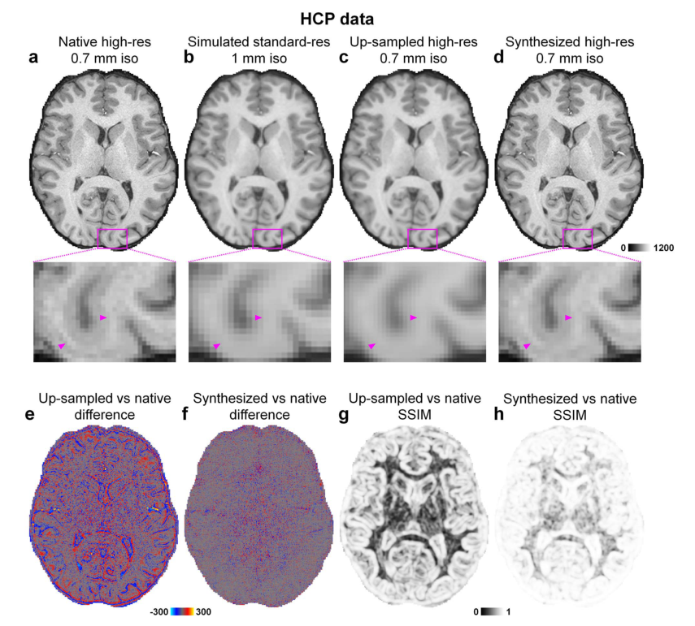

# SuperSurfer Tutorial

**SuperSurfer  pipeline**. The input is a low-resolution image volume, and the output is the residual between high-resolution image volume and the input. SuperSurfer has a network architecture comprised of stacked convolutional filters paired with nonlinear activation functions. The n-layer SuperSurfer network consists of a first layer of paired 3D convolution (k kernels of size d × d × d × 1 voxels, stride of 1 × 1 × 1 voxel) and rectified linear unit (ReLU) nonlinear activation, n − 2 middle layers of paired 3D convolution (k kernels of size d × d × d × k voxels, stride of 1 × 1 × 1 voxel) and ReLU activation, and a last 3D convolutional layer (one kernel of size d × d × d × k voxels, stride of 1 × 1 × 1 voxel). Parameter values are set n = 20, k = 64, d = 3.

**Comparison of results**. SuperSurfer synthesis results improved signal-to-noise ratio, image sharpness, and detailed anatomical information. It improves cortical surface reconstruction, and provides a unique opportunity to re-analyze legacy data acquired at standard 1-millimeter resolution. Quantitative comparison can be found in the NeuroImage paper of SuperSurfer.

## s_t1wSim.m

Step-by-step MATLAB tutorial for simulating the low-resolution images from the high-resolution data for convolutional neural network in SuperSurfer. HTML file can be automatically generated using command: publish('s_t1wSim.m', 'html').

**Input**

- *data.mat*: high-resolution images

**Output**

- *data_sim.mat*: low-resolution images prepared for CNN

## s_SuperSurfer_train.py

Step-by-step Python tutorial for training the SuperSurfer using data prepared using the s_Sim.m script.

**Utility functions**

- *supersurfer.py*: create SuperSurfer model

- *utils.py*: create custom loss functions to only include loss within brain mask; extract blocks from whole brain volume data; normalize and denormalize image

**Output**

- *supersurfer_ep60.h5*: SuperSurfer model trained for 60 epoches
- *supersurfer_ep60.mat*: L2 losses for the training and validation

## s_SuperSurfer_apply.py

Step-by-step Python tutorial for applying the trained model to synthesize high-resolution image.

**Utility function**

- *utils.py*

**Output**

- *data_supersurfer.mat*: synthesized high-resolution image

## compare.m

Step-by-step MATLAB tutorial for computing the whole-brain averaged MAD, PSNR, SSIM of simulated noisy images and denoised images.

**Output**

- *diff.png*: difference map with MAD and PSNR
- *SSIM.png*: SSIM map with SSIM

## **HCP data**

The example data are provided by the WU-Minn-Oxford Hhuman Connectome Project (HCP) (open access data use term at https://www.humanconnectome.org/study/hcp-young-adult/document/wu-minn-hcp-consortium-open-access-data-use-terms). Please acknowledge the source to the WU-Minn-Oxford HCP. The orginal data is available at https://www.humanconnectome.org/study/hcp-young-adult.

## **Refereces**

[1] Tian Q, Bilgic B, Fan Q, Ngamsombat C, Zaretskaya N, Fultz NE, Ohringer NA, Chaudhari AS, Hu Y, Witzel T, Setsompop K, Polimeni JR, Huang SY. [Improving in vivo human cerebral cortical surface reconstruction using data-driven super-resolution](https://www.ncbi.nlm.nih.gov/pmc/articles/PMC7727379/). *Cerebral Cortex*, 2021, 31(1): 463-482. [[**PDF**](https://doi.org/10.1093/cercor/bhaa237)]
